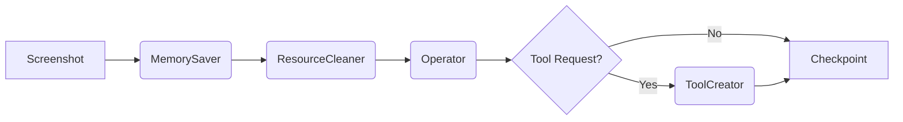

# LLM Gamer Agent

LLM Gamer Agent は、Microsoft Windows 上で動作し、Gemini を活用してコンピュータ画面上の視覚情報を認識しながら、自律的にタスクを実行したりゲームをプレイしたりするエージェントシステムです。

**Model Context Protocol (MCP)** アーキテクチャを採用しており、エージェント自身が必要に応じて Python スクリプト（MCPサーバー）を作成・実行し、能力を無制限に拡張していく「Self-Coding」機能を備えています。

## 特徴

*   **Gemini Native**: Google Gemini API (Pro/Flash) を使用し、高速な応答と強力なマルチモーダル処理を実現。Native Function Calling により、安定したツール実行が可能です。
*   **視覚的認識 (Vision)**: 画面のスクリーンショットを毎ターン取得・解析し、リアルタイムで状況を把握します。
*   **自律的なツール作成 (Self-Coding)**: タスク達成のために必要なツール（Pythonコード）をエージェント自身が生成し、即座に実行環境にデプロイして使用します。
*   **マルチエージェントパイプライン**: 役割分担された専門エージェントが連携して動作し、複雑なタスクに対応します。
*   **リアルタイムダッシュボード (Live GUI)**: エージェントの視界、思考、記憶、ツール実行ログをWebブラウザ上でリアルタイムに監視できるモダンなGUIを提供します。
*   **永続的な記憶 (Memory)**: 重要な情報をキー・バリュー形式で記憶し、エージェント間で共有します。シンプルな構造で柔軟な情報保持が可能です。
*   **中断と再開 (Resumability)**: いつでもエージェントを停止でき、JSON形式のチェックポイントからシームレスに再開可能です。

## アーキテクチャ

### マルチエージェントパイプライン

各ターンにおいて、以下の順序でエージェントが実行されます。



| 役割 | エージェント名 | 責務 | 使用可能なシステムツール |
|------|----------------|------|--------------------------|
| 📝 | **MemorySaver** | 前回の行動結果や現状を分析し、重要な情報を記憶する。 | `memory_store` |
| 🗑️ | **ResourceCleaner** | 不要になったメモリやツールを削除し、環境を整理する。 | `system_cleaner` |
| 🎮 | **Operator** | 実際のゲーム操作やタスク遂行を行う。ツールが不足している場合は作成を依頼する。 | User Created Tools, `system.request_tool` |
| 🔧 | **ToolCreator** | Operatorからの依頼に基づき、新しいツール(MCPサーバー)を作成・修正する。 | `tool_factory` |

### 記憶管理 (Memory)

メモリシステムはシンプル化され、カテゴリ区分を排しました。すべてのエージェントが共通の記憶領域にアクセスします。
情報は `Title: Content` の形式で保存され、タスクの進捗、ゲームのルール、重要な座標などを保持します。

### ツールシステム (MCP Manager)

システムは **Core (Virtual) Tools** と **User Tools** に分かれています。

1.  **Core Tools (Virtual Servers)**:
    *   `memory_store`: 記憶の保存・更新 (`set_memory`)
    *   `system_cleaner`: リソースの一括削除 (`cleanup_resources`)
    *   `tool_factory`: Pythonスクリプトの作成・編集・読込 (`create_mcp_server`, `edit_mcp_server`, etc.)

2.  **User Tools (Workspace Servers)**:
    *   エージェントが作成したPythonスクリプト。
    *   `workspace/` ディレクトリに保存され、動的にロードされます。
    *   **Operator** のみがこれらを使用できます。

## 動作環境

*   **OS**: Windows 10/11
*   **Python**: 3.10 以上
*   **LLM**: Google Gemini API Key **または** Anthropic Claude API Key

## インストール

1.  プロジェクトのルートディレクトリに移動します。

2.  仮想環境を作成し、有効化することを推奨します。
    ```bash
    python -m venv .venv
    .venv\Scripts\activate
    ```

3.  依存ライブラリをインストールします。
    ```bash
    pip install -r requirements.txt
    ```

4.  環境変数を設定します。
    `.env.example` をコピーして `.env` という名前のファイルを作成し、APIキーを設定してください。

    **Gemini を使用する場合:**
    ```ini
    LLM_PROVIDER=gemini
    GEMINI_API_KEY=your_gemini_api_key_here
    GEMINI_MODEL=gemini-3-pro-preview
    AI_LANGUAGE=Japanese
    ```

    **Claude を使用する場合:**
    ```ini
    LLM_PROVIDER=claude
    CLAUDE_API_KEY=your_anthropic_api_key_here
    CLAUDE_MODEL=claude-opus-4-5-20251101
    AI_LANGUAGE=Japanese
    ```

## 使い方

### エージェントの起動

以下のバッチファイルを実行するだけで、エージェントとダッシュボードが起動します。

```bash
./run.bat
```

または、Pythonコマンドで直接起動：

```bash
python agent.py
```

※ 過去の実行履歴が見つかった場合、ダッシュボード上で「再開 (Resume)」するか「新規開始 (Start Fresh)」するかを選択できます（またはコマンドライン引数 `--resume` で強制再開）。

### ダッシュボードへのアクセス

起動後、Webブラウザで以下のURLにアクセスしてください。

**URL**: [http://localhost:15000](http://localhost:15000)

*   **Live Vision**: エージェントが見ている現在の画面。
*   **Active Memories**: 現在保持している記憶の一覧。
*   **Cognitive Stream**: 各エージェントの思考プロセス (Thought) をリアルタイム表示。
*   **Tool Activity**: ツールの実行履歴と結果。
*   **User Input**: エージェントへの指示出しが可能。

## ディレクトリ構成

```
llmgamer/
├── agent.py            # メインパイプライン制御
├── agent_state.py      # エージェントの状態・履歴管理
├── mcp_manager.py      # MCPサーバー管理 (Virtual & User)
├── memory_manager.py   # シンプルなKey-Valueメモリ管理
├── llm_client.py       # Gemini API クライアント
├── prompts.py          # システムプロンプト定義
├── dashboard.py        # Webダッシュボード (FastAPI)
├── config.py           # 設定
├── workspace/          # 生成されたツール (MCPサーバー) が保存される場所
└── history/            # チェックポイント保存先
```

## ライセンス

MIT License
